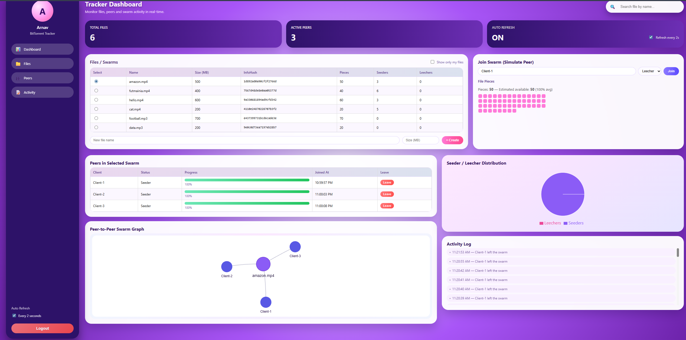

# 📘 BitTorrent Tracker Simulator — Full Stack Project

A complete **Mini BitTorrent Tracker Simulator** built with:

- **Node.js + Express** (Backend)
- **React + Vite** (Frontend)
- **MongoDB Atlas** (Cloud Database)

This project simulates a functional BitTorrent tracker with:

✔ Torrent file management  
✔ Seeders & leechers  
✔ Live swarm updates  
✔ Peer join/leave simulation  
✔ Swarm graph visualization  
✔ Activity logs  
✔ Modern UI with smooth gradients  

---

# 📸 Screenshots

> Replace these image paths with your actual screenshots.

### **Dashboard**


### **Swarm Graph**


---

# 🚀 Features

## 🟣 Backend (Node.js + Express + MongoDB)
- File model: name, size, infoHash, pieceCount, seeders, leechers  
- Peer model: clientName, status, progress, timestamps  
- Tracker APIs:
  - Create file  
  - Join swarm  
  - Leave swarm  
  - Get peers  
  - View activity  
  - Tick simulation every 2s  
- MongoDB Atlas persistence  
- JWT Authentication (Register/Login)

---

## 💠 Frontend (React + Vite)
- Modern animated UI  
- Sidebar navigation (scroll-to-sections)
- Search bar with file suggestions  
- Toggle: “Show only my files”
- Auto-refresh (2 seconds)
- Dynamic tables for files & peers
- Seeder/Leecher pie-chart
- Swarm graph using Vis-Network
- Realtime activity timeline
- Canvas-based animated gradient background

---

# 🧩 Project Structure

```
root/
│
├── backend/
│   ├── server.js
│   ├── models/
│   ├── routes/
│   ├── controllers/
│   ├── middleware/
│   ├── package.json
│   └── .env
│
└── frontend/
    ├── src/
    │   ├── components/
    │   ├── pages/
    │   ├── api.js
    │   └── App.jsx
    ├── public/
    ├── package.json
    └── .env
```

---

# 🏗️ Backend Setup

### 1️⃣ Install Dependencies
```bash
cd backend
npm install
```

### 2️⃣ Create `.env`
```env
MONGO_URI=your_mongodb_atlas_url
JWT_SECRET=your_secret_key
PORT=5000
```

### 3️⃣ Start the Server
```bash
npm start
```

Backend runs at:  
👉 `http://localhost:5000`

---

# 💻 Frontend Setup

### 1️⃣ Install Dependencies
```bash
cd frontend
npm install
```

### 2️⃣ Create `.env`
```env
VITE_API_URL=http://localhost:5000
```

### 3️⃣ Run Development Server
```bash
npm run dev
```

Frontend runs at:  
👉 `http://localhost:5173`

---

# 🔌 API Summary

## 📂 Files API

| Method | Endpoint | Description |
|--------|----------|-------------|
| GET | `/tracker/files` | Get all files |
| POST | `/tracker/file` | Create a new file |

## 👥 Peers API

| Method | Endpoint | Description |
|--------|----------|-------------|
| GET | `/tracker/peers/:fileId` | List peers in swarm |
| POST | `/tracker/join` | Peer joins swarm |
| POST | `/tracker/leave` | Peer leaves swarm |

## 📝 Simulation & Activity

| Method | Endpoint | Description |
|--------|----------|-------------|
| POST | `/tracker/tick` | Run simulation tick |
| GET | `/tracker/activity/:fileId` | Fetch activity logs |

---

# ⚙️ How the Simulator Works

### ✔ Add File  
Auto-generates:
- InfoHash  
- Piece count  

### ✔ Join Swarm  
Each peer gets:
- Name  
- Seeder / Leecher status  
- Progress (auto-updated)  
- Logged in activity  

### ✔ Leave Swarm  
Peer is removed and activity recorded.

### ✔ Tick Simulation (Every 2 seconds)
- Updates peer progress  
- Updates seeder/leecher count  
- Refreshes UI  
- Updates swarm graph  
- Appends activity logs  

---

# 🎨 UI Components

- 📊 Stats Cards  
- 📁 Files Table  
- 👥 Peers Table  
- 🧠 Smart Search  
- 🕸 Swarm Graph (Vis.js)  
- 🥧 Seeder/Leecher Pie Chart  
- 📜 Activity Log  
- 🟣 Animated Gradient Background  
- 📌 Sticky Sidebar  

---

# 🌐 Deployment Guide

## 🚀 Backend → Render  
1. Create **Web Service**  
2. Connect GitHub repo  
3. Add `.env` variables  
4. Build command:
   ```
   npm install
   ```
5. Start command:
   ```
   npm start
   ```

## 🚀 Frontend → Vercel  
1. Import GitHub repo  
2. Add environment variable:
   ```
   VITE_API_URL=https://your-backend-render-url
   ```
3. Deploy

---

# 🔐 Authentication

- JWT-based  
- Token stored in localStorage  
- Auto redirect if user not logged in  
- Logout clears all session data  

---

# 🏁 Conclusion

This project fully implements a **BitTorrent Tracker Simulator**, including:

✔ File → Peer mapping  
✔ Swarm simulation  
✔ Seeder/leecher management  
✔ Live progress tracking  
✔ Swarm graph  
✔ Activity log  
✔ Full-stack deployment  
